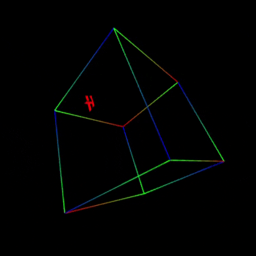

# tugas-3-xhazimix
tugas-3-xhazimix created by GitHub Classroom

Tugas kali ini adalah implementasikan aplikasi Grafika sebagaimana tampak pada gambar ilustrasi.
Secara detail, aplikasi grafika ini memiliki Sebuah Kubus yang di dalamnya terdapat Huruf Depan Nama Anda.
Huruf depan ini Berputar terhadap Sumbu Y (Sumbu Y lokal yang ada di tubuh huruf tersebut).
Selain itu huruf ini ber-Translasi bebas di dalam kubus. Ketika menabrak dinding dalam kubus, huruf akan memantul.

Berikut adalah hasil dari tugas ini.

Buka di azure: http://grafkomc-170082.azurewebsites.net/nama_dalam_kubus/
